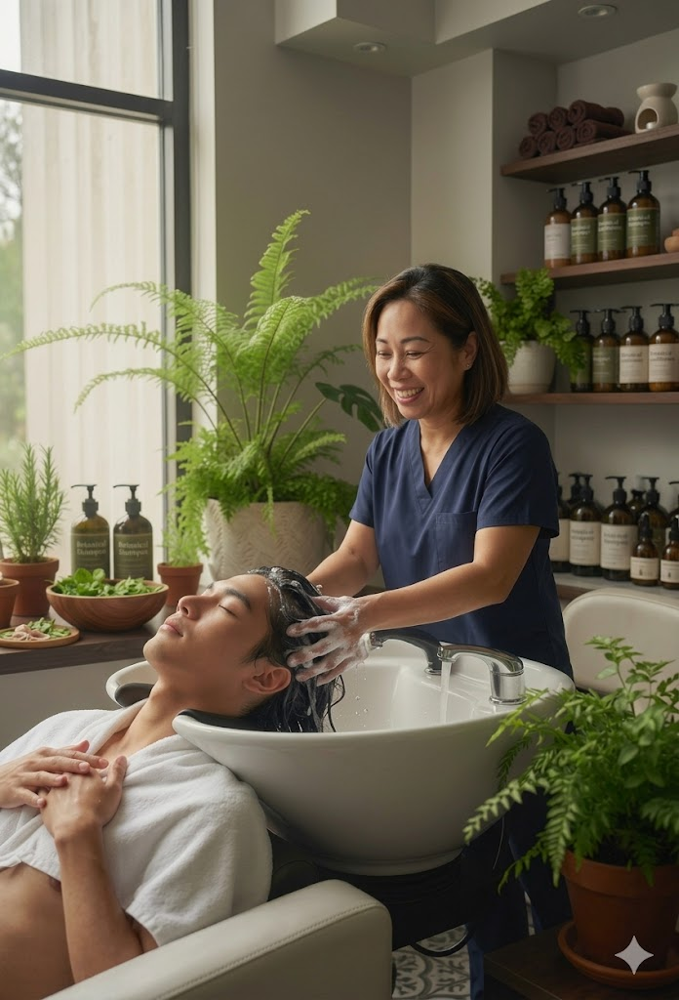
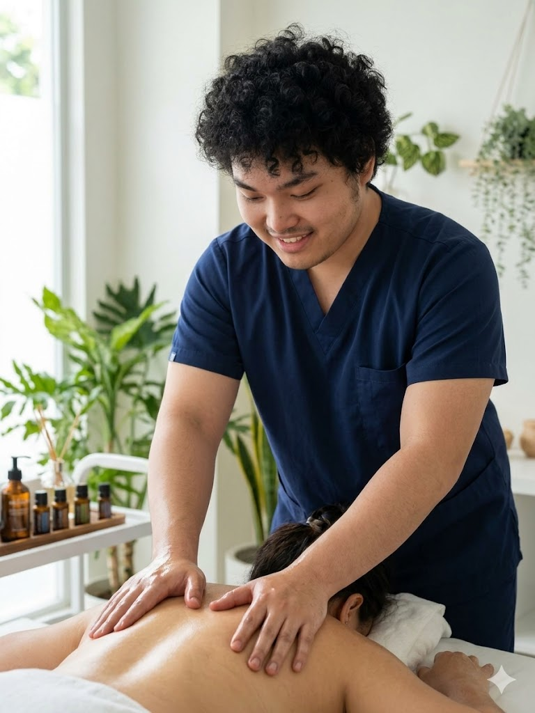

# The Scalp Lab — Website

A static landing page for **The Scalp Lab**, a mother & son wellness business based in Boronia, VIC, specialising in scalp treatments, therapeutic massage, and holistic wellness.

---

## Project Structure

```
wellnesswebsite/
├── website.html          # Main HTML file
├── hero1.webp            # Hero carousel image 1
├── hero2.webp            # Hero carousel image 2
├── hero3.webp            # Hero carousel image 3
├── hero4.webp            # Hero carousel image 4
├── hero5.webp            # Hero carousel image 5
└── images/
    ├── scalp.jpg         # Service card — Hair & Scalp Treatments
    └── franzmassage.jpg  # Service card — Therapeutic Massage
```

---

## Sections

| Section | Description |
|---|---|
| **Nav** | Sticky navigation with links to About, Services, Contact, and a Book Now CTA |
| **Hero** | Headline, tagline, CTA buttons, and an auto-rotating image carousel |
| **About** | Intro text and team cards for Roselle and Franz |
| **Philosophy** | Full-width quote banner — "We treat the scalp like a garden" |
| **Services** | 3 service cards: Scalp Treatments, Therapeutic Massage, Consultations |
| **Testimonials** | 3 client review cards |
| **CTA Banner** | Booking prompt with link to Contact section |
| **Contact** | Address, phone, email, and opening hours |
| **Footer** | Business name and copyright |

---

## Adding Images

### Hero Carousel
The carousel rotates through 5 images automatically. To swap them out, replace the `.webp` files in the root folder with your own images, keeping the same filenames:
```
hero1.webp, hero2.webp, hero3.webp, hero4.webp, hero5.webp
```

### Service Cards
Service images live in the `images/` folder. They are referenced in the HTML like:
```html


```
To update, replace the files or change the `src` path to point to your new image.

### Team Photos (optional)
The About section currently uses initials circles (R / F). To add real photos, replace the `.initials` div in each `.team-card` with:
```html

```

---

## Customisation Notes

- **Business name:** Currently set to "The Scalp Lab" in the nav/title, but the footer still reads "Glow & Flow" — update if needed
- **Colours:** All colours are defined as CSS variables at the top of the `<style>` block for easy editing
- **Pricing:** Service prices are hardcoded in the HTML — search for `$` to find and update them
- **Hours:** Opening hours are in the Contact section inside `.hours-row` elements

---

## Contact Details

| | |
|---|---|
| **Location** | Boronia VIC 3155 |
| **Phone** | +61 425 069 956 |
| **Email** | roselle.dolera@yahoo.com |

---

## Tech Stack

- Plain HTML + CSS (no frameworks or dependencies)
- No JavaScript required
- Fully static — can be opened directly in a browser or hosted on any web server

---

*© 2026 The Scalp Lab. All rights reserved.*
